# 1. Introduction

## 1.1. Scope of the document
This document provides a comprehensive detailed design for the **Legal Case Management System**. It outlines the system architecture, component design, data models, and interface definitions required to build and maintain the application. The document serves as a reference for developers, testers, and stakeholders involved in the project.

## 1.2. Intended Audience
The intended audience for this document includes:
*   **Developers**: To understand the technical implementation details.
*   **System Architects**: To review the architectural decisions and patterns.
*   **Project Managers**: To gain an overview of the system components and progress.
*   **QA Engineers**: To understand the system flow for testing purposes.

## 1.3. System overview
The Legal Case Management System is a web-based application designed to help legal professionals manage their cases and clients efficiently. It features a modern **React-based frontend** for user interaction and a robust **FastAPI (Python) backend** for data processing and business logic. The system uses **PostgreSQL** as its persistent data store and is containerized using **Docker** for consistent deployment environments, with support for **Kubernetes** orchestration.

# 2. System Design

## 2.1. Application Design
The application follows a **Microservices-style Architecture** (or decoupled Client-Server architecture):
*   **Frontend**: A Single Page Application (SPA) built with **React** (Vite), **Tailwind CSS**, and **React Router**. It handles the presentation layer and user interactions.
*   **Backend**: A RESTful API built with **FastAPI**. It handles business logic, authentication, and database interactions.
*   **Database**: **PostgreSQL** relational database for storing persistent data.
*   **Infrastructure**: The system is containerized using **Docker** and orchestrated via **Docker Compose** (for development) and **Kubernetes** (for production).

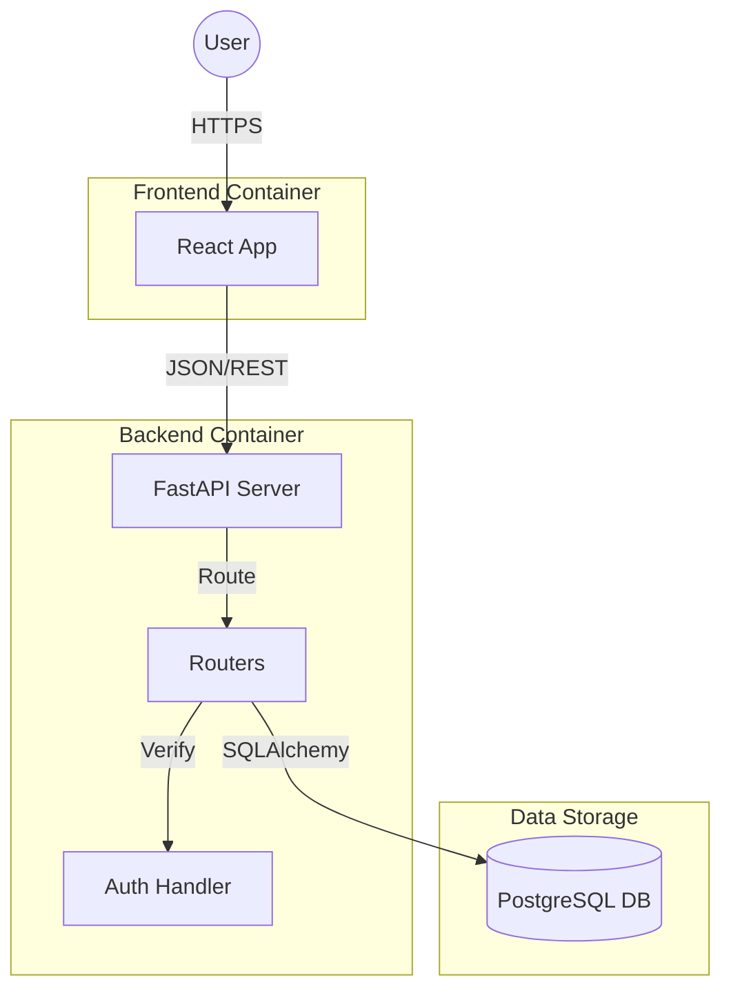

## 2.2. Process Flow
The typical process flow involves:
1.  **User Action**: The user interacts with the React Frontend (e.g., logging in, creating a case).
2.  **API Request**: The Frontend sends an HTTP/HTTPS request (GET, POST, PUT, DELETE) to the FastAPI Backend.
3.  **Authentication**: Requests are intercepted by middleware (e.g., CORS) and authenticated using JWT Bearer tokens (where applicable).
4.  **Business Logic**: The Backend processes the request using logic defined in Routers (`cases`, `users`).
5.  **Data Access**: The Backend interacts with the PostgreSQL database via SQLAlchemy ORM to CRUD (Create, Read, Update, Delete) data.
6.  **Response**: The Backend returns a JSON response to the Frontend.
7.  **UI Update**: The Frontend updates the UI based on the response.

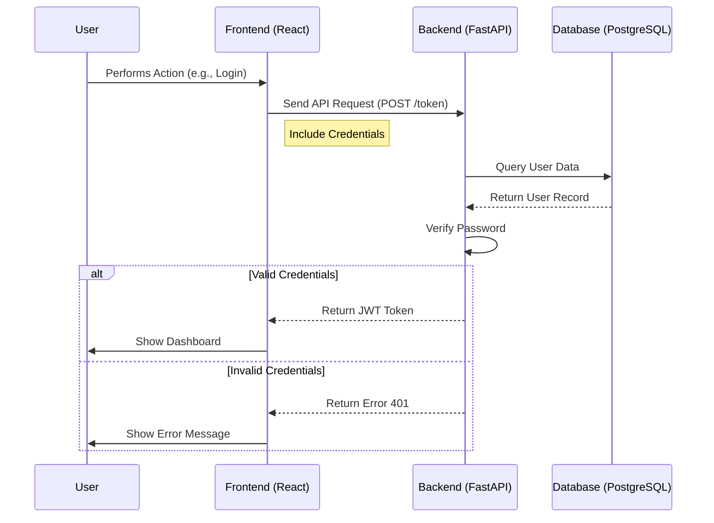

## 2.3. Information Flow
Data flows primarily between the Client (Browser), the API Server, and the Database.
*   **Client -> Server**: JSON payloads containing user input (e.g., case details, login credentials).
*   **Server -> Database**: SQL queries generated by the ORM.
*   **Database -> Server**: Result sets (User records, Case records).
*   **Server -> Client**: JSON responses/pydantic models.

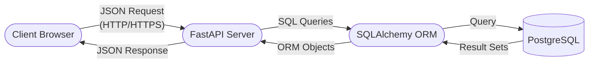

## 2.4. Components Design
### Frontend Components
*   **App.jsx**: Main application entry point and routing configuration.
*   **Pages**: Individual views (e.g., Login, Dashboard, Case List, Case Detail).
*   **Components**: Reusable UI elements (e.g., Navbar, Forms, Modals).
*   **Services**: API integration layer (`axios` calls).

### Backend Components
*   **main.py**: Application entry point, lifespan management (startup/shutdown), and CORS configuration.
*   **routers/**:
    *   `users.py`: Handles user registration, login, and profile management.
    *   `cases.py`: Handles case creation, retrieval, updates, and deletion.
*   **models.py**: SQLAlchemy database models (`User`, `Case`).
*   **schemas.py**: Pydantic models for request/response validation.
*   **database.py**: Database connection handling and session management.

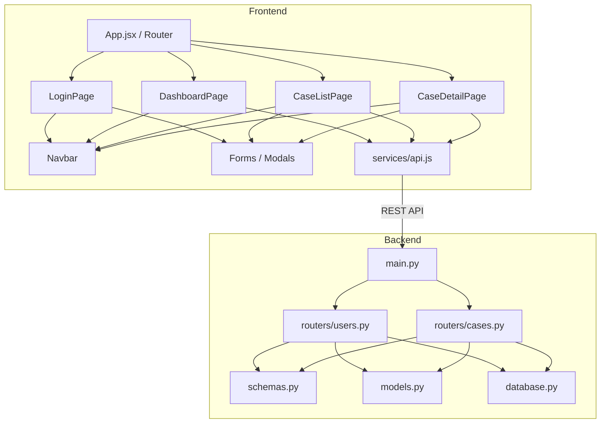

## 2.5. Key Design Considerations
*   **Scalability**: The decoupled architecture allowing backend and frontend to scale independently.
*   **Maintainability**: Use of standard frameworks (FastAPI, React) and clear folder structure.
*   **Portability**: Docker containerization ensures the app runs consistently across different environments.
*   **Type Safety**: Usage of Pydantic and type hinting in Python ensures data validation.

## 2.6. API Catalogue
The Backend exposes the following REST endpoints:

**Users** (`/users`):
*   `POST /`: Register a new user.
*   `POST /token`: Login and retrieve an access token.
*   `GET /me`: Get current user details.

**Cases** (`/cases`):
*   `GET /`: Retrieve all cases.
*   `POST /`: Create a new case.
*   `GET /{case_id}`: Retrieve a specific case.
*   `PUT /{case_id}`: Update a specific case.
*   `DELETE /{case_id}`: Delete a specific case.

**General**:
*   `GET /`: Root endpoint (Welcome message).
*   `GET /health`: Health check endpoint.

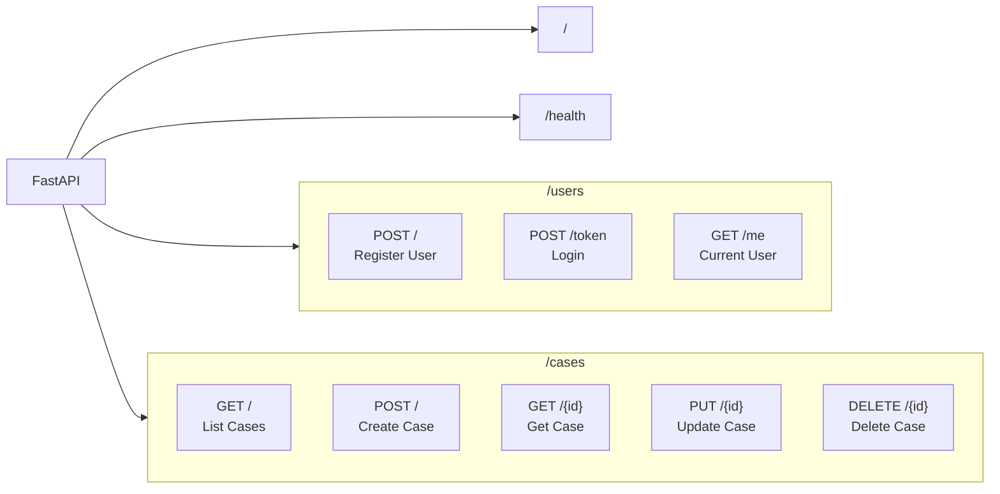

# 3. Data Design

## 3.1. Data Model
The database schema consists of the following key entities:

### User
*   **id** (Integer, PK): Unique identifier.
*   **username** (String, Unique): User login name.
*   **email** (String, Unique): User email address.
*   **full_name** (String): Full name of the user.
*   **password** (String): Hashed password.
*   **is_active** (Boolean): Account status.

### Case
*   **id** (Integer, PK): Unique identifier.
*   **title** (String): Title of the legal case.
*   **description** (String): Detailed description.
*   **client_name** (String): Name of the client associated with the case.
*   **status** (Enum): Status (OPEN, CLOSED, PENDING).
*   **created_at** (DateTime): Timestamp of creation.
*   **updated_at** (DateTime): Timestamp of last update.

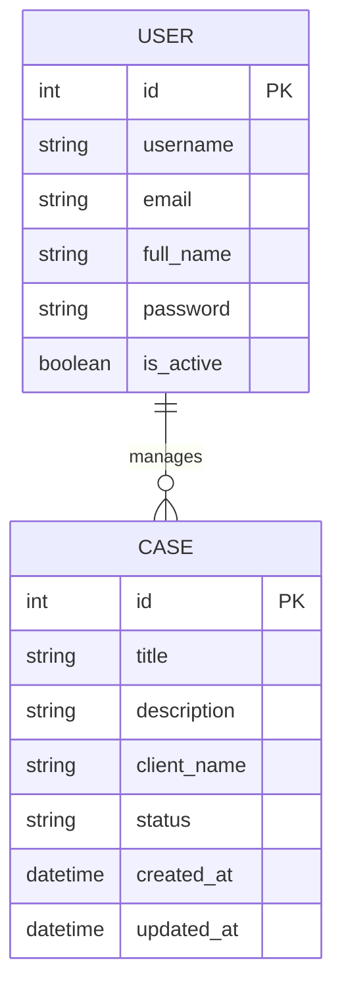

## 3.2. Data Access Mechanism
Data access is managed through **SQLAlchemy ORM**. The application uses a `SessionLocal` dependency (`get_db`) to manage database transactions. This ensures that database connections are opened and closed properly for each request.

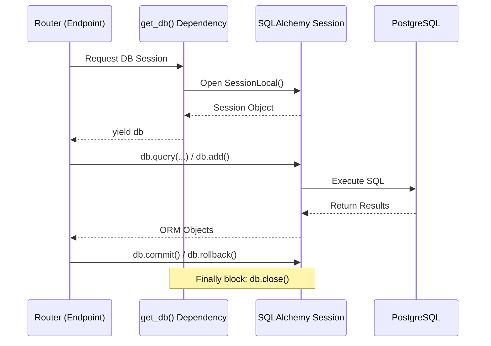

## 3.3. Data Retention Policies
*(Current Implementation defaults)*: Data is retained indefinitely unless manually deleted via the `DELETE` APIs.

## 3.4. Data Migration
Database schema creation is handled by `Base.metadata.create_all(bind=engine)` on application startup. For production, a migration tool like **Alembic** is recommended (though not currently implemented in the basic setup).

# 4. Interfaces
*   **User Interface (UI)**: Web-based GUI accessed via browser (default: `http://localhost:3000` or `http://localhost:5173`).
*   **Application Programming Interface (API)**: JSON REST API over HTTP (default: `http://localhost:8000`).
*   **Database Interface**: PostgreSQL connection via TCP/IP on port 5432 using the `psycopg2` driver.

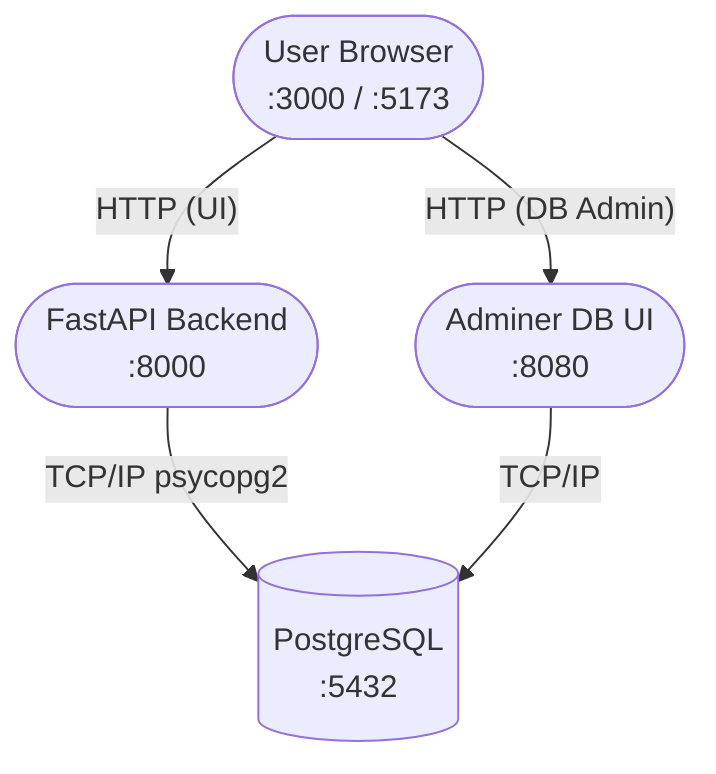

# 5. State and Session Management
*   **Backend**: The backend is stateless. Session management is handled via **JWT (JSON Web Tokens)** (Bearer Token) passed in the `Authorization` header.
*   **Frontend**: State is managed using React's internal state mechanism (`useState`, `useEffect`, `Context API`). Authentication tokens are typically stored in `localStorage` or `sessionStorage` (implementation specific) to persist login sessions.

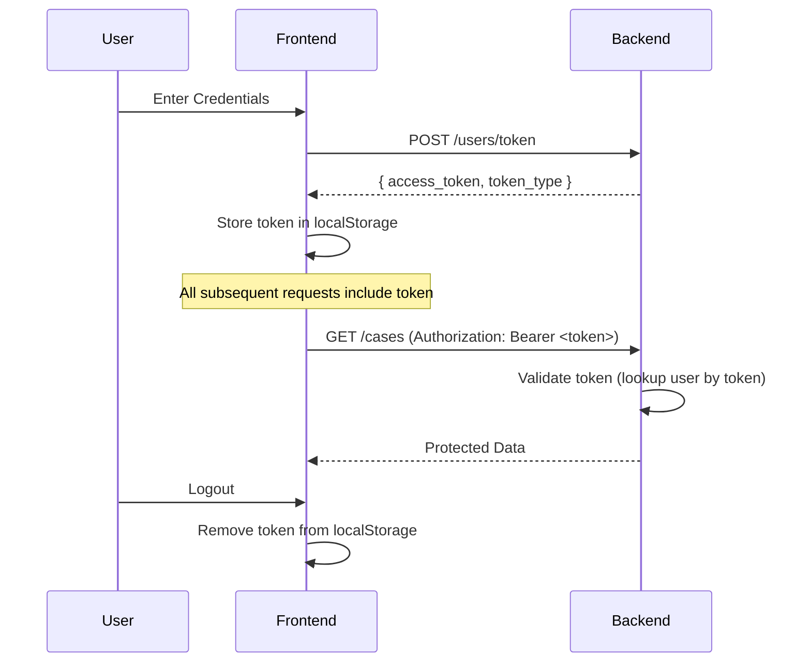

# 6. Caching
*   *(Current Implementation)*: No explicit caching layer (e.g., Redis) is currently implemented.
*   **Browser Caching**: Static assets (JS, CSS) served by the frontend can be cached by the browser.

# 7. Non-Functional Requirements

## 7.1. Security Aspects
*   **Authentication**: OAuth2-style password flow with Bearer tokens.
*   **Password Hashing**: Passwords should be hashed before storage (Implementation note: Code contains TODOs for full production hashing implementation).
*   **CORS**: Configured to restrict cross-origin requests to trusted domains (e.g., localhost).
*   **Container Security**: Running services in isolated Docker containers helps limit the blast radius of potential exploits.

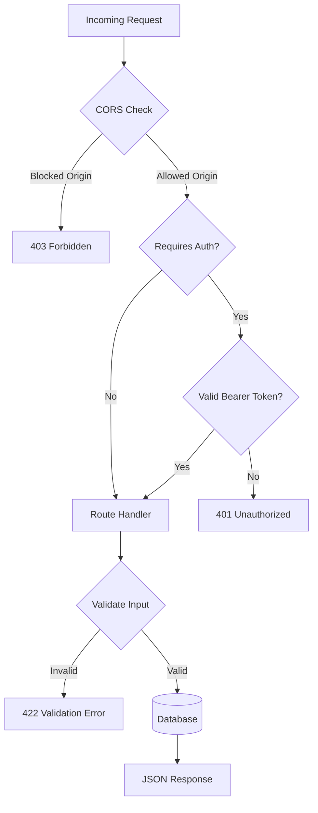

## 7.2. Performance Aspects
*   **Async/Await**: FastAPI uses Python's `asyncio` for high-performance non-blocking I/O.
*   **Vite**: Uses ES modules for fast frontend development and optimized production builds.
*   **Database Indexing**: Primary keys and unique constraints are indexed for faster lookups.

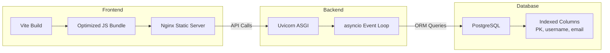

# 8. References
*   [FastAPI Documentation](https://fastapi.tiangolo.com/)
*   [React Documentation](https://react.dev/)
*   [PostgreSQL Documentation](https://www.postgresql.org/docs/)
*   [Docker Documentation](https://docs.docker.com/)
*   [Kubernetes Documentation](https://kubernetes.io/docs/)
